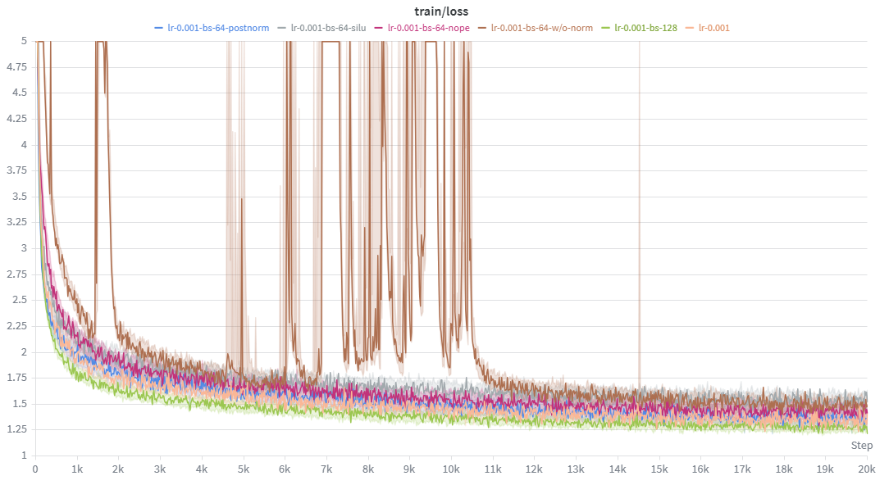

# CS336 Spring 2025 Assignment 1: Basics

For a full description of the assignment, see the assignment handout at
[cs336_assignment1_basics.pdf](./cs336_assignment1_basics.pdf)

If you see any issues with the assignment handout or code, please feel free to
raise a GitHub issue or open a pull request with a fix.

## Setup

### Environment
We manage our environments with `uv` to ensure reproducibility, portability, and ease of use.
Install `uv` [here](https://github.com/astral-sh/uv#installation) (recommended), or run `pip install uv`/`brew install uv`.
We recommend reading a bit about managing projects in `uv` [here](https://docs.astral.sh/uv/guides/projects/#managing-dependencies) (you will not regret it!).

You can now run any code in the repo using
```sh
uv run <python_file_path>
```
and the environment will be automatically solved and activated when necessary.

### Run unit tests


```sh
uv run pytest
```

Initially, all tests should fail with `NotImplementedError`s.
To connect your implementation to the tests, complete the
functions in [./tests/adapters.py](./tests/adapters.py).

### Download data
Download the TinyStories data and a subsample of OpenWebText

``` sh
mkdir -p data
cd data

wget https://huggingface.co/datasets/roneneldan/TinyStories/resolve/main/TinyStoriesV2-GPT4-train.txt
wget https://huggingface.co/datasets/roneneldan/TinyStories/resolve/main/TinyStoriesV2-GPT4-valid.txt

wget https://huggingface.co/datasets/stanford-cs336/owt-sample/resolve/main/owt_train.txt.gz
gunzip owt_train.txt.gz
wget https://huggingface.co/datasets/stanford-cs336/owt-sample/resolve/main/owt_valid.txt.gz
gunzip owt_valid.txt.gz

cd ..
```

## Core code list

- `cs336_basics/`
- `tests/adapters.py`

## Response to the assignment questions



Setting | Val Loss
-------------|---------
learning_rate=1e-3 | 1.35
batch_size=64 --> batch_size=128 (iterations=20000) | 1.29
batch_size=64 --> batch_size=128 (iterations=10000) | 1.38
RMSNorm --> no RMSNorm | 1.49
pre-norm --> post-norm | 1.37
RoPE --> NoPE | 1.49
SwiGLU --> SiLU | 1.54

**1. Problem (learning_rate):  Tune the learning rate**

The choice of learning rate significantly impacts training results. On TinyStories, a learning rate of 1e-3 outperforms both 1e-4 and 1e-5.

**2. Problem (batch_size_experiment):  Batch size variations**

With all other parameters held constant, increasing the batch size accelerates training (loss decreases faster within the same number of steps). However, given the same total tokens processed (batch size × total step count × context length), larger batch sizes perform slightly worse than smaller batch sizes on TinyStories.

**3. Problem (layer_norm_ablation):  Remove RMSNorm and train**

Removing RMSNorm makes training unstable, but the loss still converges in the end, with no significant degradation in the final metric.

**4. Problem (pre_norm_ablation):  Implement post-norm and train**

On TinyStories, pre-norm and post-norm perform similarly, with post-norm being slightly worse than pre-norm.

**5. Problem (no_pos_emb):  Implement NoPE**

On TinyStories, models without positional encoding (NoPE) underperform models with positional encoding.

**6. Problem (swiglu_ablation):  SwiGLU vs. SiLU**

On TinyStories, models using SwiGLU outperform those using SiLU.